# Authentication Flow Analysis

## System Architecture

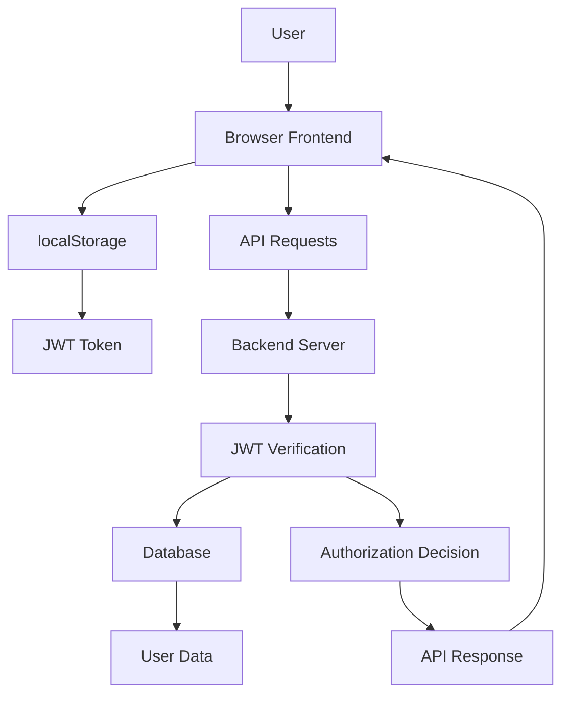

## Authentication Flow Steps

### 1. User Registration
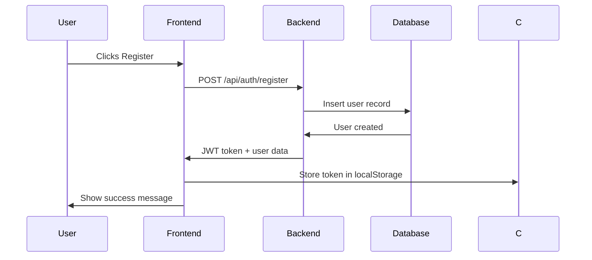

### 2. User Login
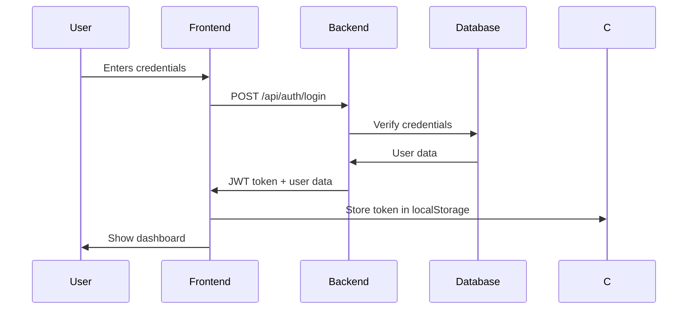

### 3. API Request with Authentication
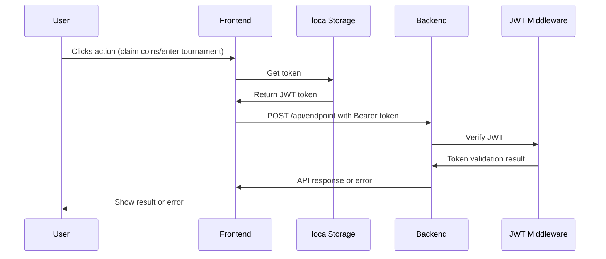

## Current Issues Identified

### 1. Token Validation Problems
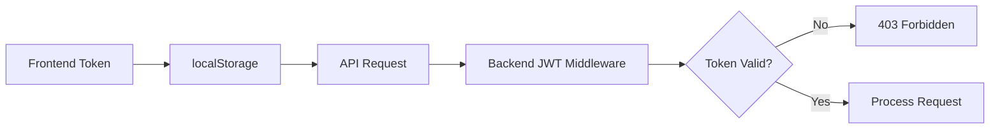

**Potential Issues:**
- Token secret mismatch
- Token format corruption
- Token expiration
- Invalid token encoding

### 2. Tournament Options Display Issues
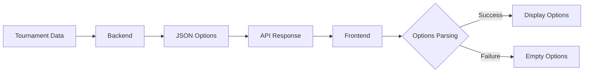

**Potential Issues:**
- JSON parsing errors
- Tournament type mismatch
- Missing options field
- Incorrect data structure

## Data Flow Analysis

### JWT Token Lifecycle
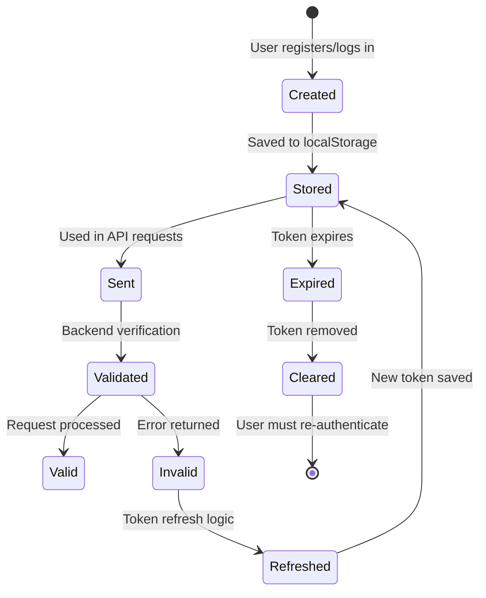

### Tournament Data Flow
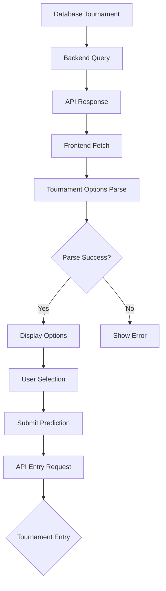

## Solution Implementation Strategy

### 1. Authentication Fixes
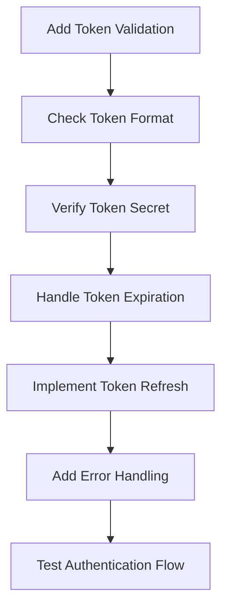

### 2. Tournament Options Fixes
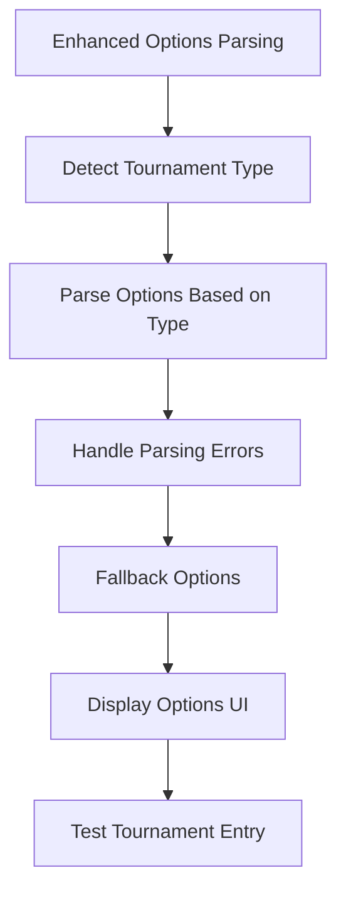

## Testing Strategy

### 1. Authentication Testing
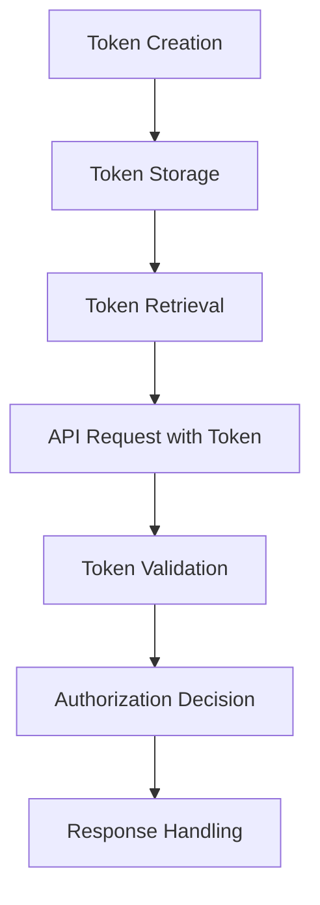

### 2. Tournament Testing
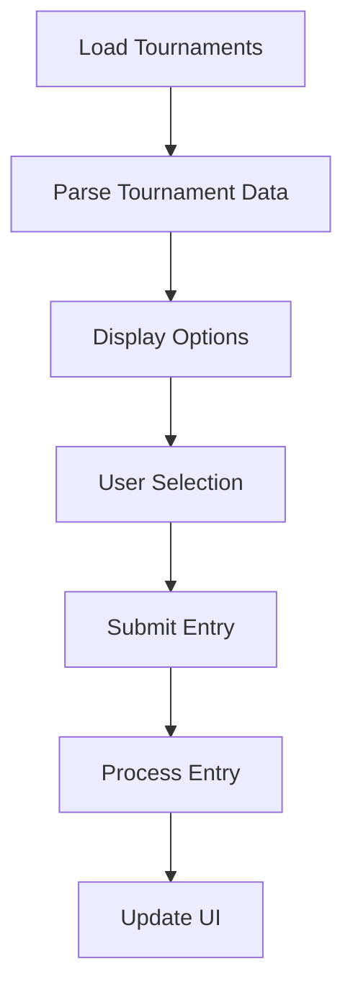

This analysis provides a comprehensive view of the authentication flow and identifies the key areas where issues might occur. The diagrams help visualize the system architecture and potential problem areas.