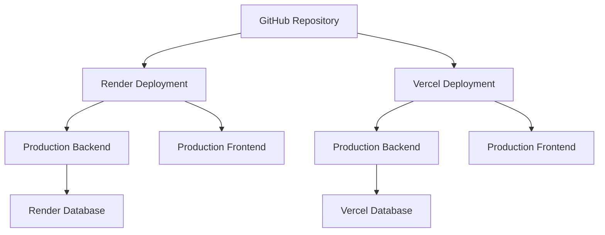

# Deployment Validation Guide: GitHub to Render & Vercel

## Overview
This guide provides comprehensive testing procedures for validating the authentication and tournament fixes when deploying to Render and Vercel via GitHub.

## Deployment Architecture

### Multi-Platform Deployment Setup


## Pre-Deployment Validation

### 1. Code Review Checklist
Before deploying, ensure all fixes are properly implemented:

#### Authentication Fixes:
- [ ] Token validation function added to `frontend/app.js`
- [ ] Enhanced authenticated request function implemented
- [ ] `submitDailyPrediction` function updated
- [ ] `enterTournament` function updated
- [ ] `loadUserData` function updated
- [ ] Initialization logic enhanced

#### Tournament Options Fixes:
- [ ] `openTournamentModal` function enhanced
- [ ] Tournament options parsing logic improved
- [ ] Error handling for parsing failures added
- [ ] Fallback options implemented

### 2. Local Testing Environment
```bash
# Test locally before deployment
# 1. Start backend server
cd backend
npm install
npm start

# 2. Start frontend (simple server)
cd frontend
npx serve -s . -l 3000

# 3. Test functionality in browser
# - Register new user
# - Login
# - Claim free coins
# - Enter tournament with options
```

## Platform-Specific Deployment Considerations

### Render Deployment

#### 1. Render Service Configuration
```yaml
# render.yaml (example configuration)
services:
  - type: web
    name: predictions-backend
    env: node
    buildCommand: npm install
    startCommand: node server.js
    envVars:
      - key: NODE_ENV
        value: production
      - key: JWT_SECRET
        value: your-production-jwt-secret
      - key: PORT
        value: 10000
      - key: DATABASE_URL
        value: your-render-database-url

  - type: web
    name: predictions-frontend
    env: static
    buildCommand: npm install && npm run build
    staticPublishPath: ./frontend/build
    envVars:
      - key: API_BASE_URL
        value: https://predictions-backend.onrender.com/api
```

#### 2. Render-Specific Validation Steps
1. **Environment Variables Check**:
   ```bash
   # Check if all required env vars are set
   echo $JWT_SECRET
   echo $DATABASE_URL
   echo $NODE_ENV
   ```

2. **Database Migration**:
   ```sql
   -- Ensure database schema is up to date
   -- Check that tournaments table has correct structure
   -- Verify users table has all required fields
   ```

3. **CORS Configuration**:
   ```javascript
   // In backend/server.js, ensure CORS is configured for Render
   app.use(cors({
     origin: ['https://predictions-frontend.onrender.com'],
     credentials: true
   }));
   ```

### Vercel Deployment

#### 1. Vercel Configuration
```json
{
  "version": 2,
  "builds": [
    {
      "src": "backend/package.json",
      "use": "@vercel/node"
    },
    {
      "src": "frontend/package.json",
      "use": "@vercel/static"
    }
  ],
  "routes": [
    {
      "src": "/api/(.*)",
      "dest": "backend/server.js"
    },
    {
      "src": "/(.*)",
      "dest": "frontend/index.html"
    }
  ],
  "env": {
    "JWT_SECRET": "@vercel/env:JWT_SECRET",
    "DATABASE_URL": "@vercel/env:DATABASE_URL",
    "NODE_ENV": "production"
  }
}
```

#### 2. Vercel-Specific Validation Steps
1. **API Routes Configuration**:
   - Verify API routes are correctly proxied
   - Check that frontend can reach backend endpoints

2. **Environment Variables**:
   ```bash
   # Vercel environment variables
   vercel env add JWT_SECRET
   vercel env add DATABASE_URL
   vercel env add NODE_ENV
   ```

3. **Static File Serving**:
   - Ensure frontend assets are served correctly
   - Check that API calls work from the deployed frontend

## Cross-Platform Testing Strategy

### 1. Automated Testing Script
Create a validation script that can be run on both platforms:

```javascript
// tests/validation.js
const testScenarios = {
  authentication: {
    registration: {
      steps: [
        "Navigate to registration page",
        "Fill registration form",
        "Submit registration",
        "Verify token creation"
      ],
      expected: "User registered successfully"
    },
    login: {
      steps: [
        "Navigate to login page",
        "Enter credentials",
        "Submit login",
        "Verify token storage"
      ],
      expected: "User logged in successfully"
    },
    freeCoins: {
      steps: [
        "Login with valid user",
        "Navigate to daily challenge",
        "Click claim button",
        "Check points balance"
      ],
      expected: "Points increased by 500"
    }
  },
  tournaments: {
    optionsDisplay: {
      steps: [
        "Login with valid user",
        "Navigate to tournaments",
        "Click enter tournament",
        "Verify options display"
      ],
      expected: "Prediction options visible"
    },
    tournamentEntry: {
      steps: [
        "Select prediction option",
        "Click enter tournament",
        "Check confirmation message"
      ],
      expected: "Successfully entered tournament"
    }
  }
};

function runValidation(platform) {
  console.log(`Running validation for ${platform}...`);
  
  // Implement actual test logic here
  // This could be a puppeteer script or similar
  
  return testScenarios;
}
```

### 2. Manual Testing Checklist
#### Authentication Testing:
- [ ] User registration works on both platforms
- [ ] User login works on both platforms
- [ ] Token is properly stored in localStorage
- [ ] Free coins claiming works without errors
- [ ] Session persists across page refreshes
- [ ] Logout functionality works

#### Tournament Testing:
- [ ] Tournament list loads on both platforms
- [ ] Tournament options display correctly
- [ ] Prediction selection works
- [ ] Tournament submission works
- [ ] Points are deducted correctly
- [ ] Confirmation message appears

#### Cross-Platform Testing:
- [ ] Render deployment works correctly
- [ ] Vercel deployment works correctly
- [ ] Both platforms use the same backend
- [ ] CORS settings work for both platforms
- [ ] API endpoints are accessible from both platforms

## Platform-Specific Issue Resolution

### Render-Specific Issues

#### 1. Database Connection Issues
```javascript
// Backend connection for Render
const db = new sqlite3.Database('./predictions.db', (err) => {
  if (err) {
    console.error('Render database connection error:', err);
    // Fallback to in-memory database for development
    if (process.env.NODE_ENV === 'development') {
      db = new sqlite3.Database(':memory:', (err) => {
        if (err) console.error('Memory database error:', err);
      });
    }
  } else {
    console.log('Connected to SQLite database on Render');
  }
});
```

#### 2. Environment Variable Issues
```javascript
// Fallback for missing environment variables
const JWT_SECRET = process.env.JWT_SECRET || 'fallback-secret-key';
const NODE_ENV = process.env.NODE_ENV || 'development';
const PORT = process.env.PORT || 3001;
```

### Vercel-Specific Issues

#### 1. API Route Issues
```javascript
// Vercel API route handling
const express = require('express');
const app = express();

// Handle all API routes
app.use('/api', require('./api-routes'));

// For Vercel serverless functions
module.exports = app;
```

#### 2. Static File Issues
```javascript
// Vercel static file configuration
const express = require('express');
const app = express();
const path = require('path');

// Serve static files
app.use(express.static(path.join(__dirname, 'frontend')));

// Handle all other routes
app.get('*', (req, res) => {
  res.sendFile(path.join(__dirname, 'frontend', 'index.html'));
});
```

## Deployment Validation Steps

### Step 1: GitHub Push
```bash
# Commit all changes
git add .
git commit -m "Implement authentication and tournament fixes"
git push origin main

# Create pull request if needed
gh pr create --title "Auth and Tournament Fixes" --body "Implementation of authentication fixes and tournament options display improvements"
```

### Step 2: Render Deployment
1. **Connect GitHub to Render**:
   - Go to Render dashboard
   - Connect GitHub repository
   - Configure services as specified above

2. **Environment Setup**:
   ```bash
   # Set environment variables in Render dashboard
   JWT_SECRET=your-secure-jwt-secret
   DATABASE_URL=file:./predictions.db
   NODE_ENV=production
   CORS_ORIGIN=https://your-frontend.onrender.com
   ```

3. **Database Setup**:
   ```sql
   -- Initialize database with sample data
   -- Run database migrations if needed
   -- Verify tournament data is present
   ```

### Step 3: Vercel Deployment
1. **Connect GitHub to Vercel**:
   - Go to Vercel dashboard
   - Import GitHub repository
   - Configure project settings

2. **Environment Setup**:
   ```bash
   # Set environment variables in Vercel dashboard
   JWT_SECRET=your-secure-jwt-secret
   DATABASE_URL=file:./predictions.db
   NODE_ENV=production
   API_BASE_URL=https://your-backend.vercel.app/api
   ```

### Step 4: Cross-Platform Testing
```bash
# Create test users on each platform
# Test authentication flow
# Test tournament functionality
# Compare results between platforms

# Test script example
node tests/validation.js --platform=render
node tests/validation.js --platform=vercel
```

## Monitoring and Maintenance

### 1. Logging Configuration
```javascript
// Enhanced logging for production
const logger = require('morgan');
const winston = require('winston');

// Configure Winston logger
const logger = winston.createLogger({
  level: 'info',
  format: winston.format.json(),
  transports: [
    new winston.transports.File({ filename: 'error.log', level: 'error' }),
    new winston.transports.File({ filename: 'combined.log' })
  ]
});

// Add to Express app
app.use(logger('combined'));
```

### 2. Error Monitoring
```javascript
// Error tracking for production
const Sentry = require('@sentry/node');

Sentry.init({
  dsn: 'your-sentry-dsn',
  environment: process.env.NODE_ENV
});

// Add error handler
app.use(Sentry.Handlers.errorHandler());
```

### 3. Health Checks
```javascript
// Health check endpoints
app.get('/health', (req, res) => {
  res.json({ 
    status: 'ok', 
    timestamp: new Date().toISOString(),
    platform: process.env.PLATFORM || 'unknown'
  });
});

app.get('/api/health', (req, res) => {
  res.json({ 
    status: 'ok', 
    database: 'connected',
    jwt: 'configured'
  });
});
```

## Troubleshooting Common Issues

### 1. CORS Issues
```javascript
// Platform-specific CORS configuration
const allowedOrigins = {
  render: ['https://your-frontend.onrender.com'],
  vercel: ['https://your-frontend.vercel.app'],
  local: ['http://localhost:3000']
};

const currentOrigin = allowedOrigins[process.env.PLATFORM] || allowedOrigins.local;

app.use(cors({
  origin: currentOrigin,
  credentials: true
}));
```

### 2. Database Connection Issues
```javascript
// Database connection with retries
const connectWithRetry = () => {
  console.log('Attempting database connection...');
  
  return new Promise((resolve, reject) => {
    const db = new sqlite3.Database('./predictions.db', (err) => {
      if (err) {
        console.error('Database connection error:', err);
        if (process.env.NODE_ENV === 'production') {
          setTimeout(connectWithRetry, 5000);
        } else {
          reject(err);
        }
      } else {
        console.log('Database connected successfully');
        resolve(db);
      }
    });
  });
};
```

### 3. JWT Configuration Issues
```javascript
// JWT configuration validation
const jwtConfig = {
  secret: process.env.JWT_SECRET,
  expiresIn: process.env.JWT_EXPIRES_IN || '7d',
  algorithm: 'HS256'
};

if (!jwtConfig.secret) {
  console.error('JWT_SECRET not configured');
  process.exit(1);
}
```

## Final Validation Checklist

### Before Going Live:
- [ ] All tests pass on both platforms
- [ ] Environment variables are set correctly
- [ ] Database is properly initialized
- [ ] CORS settings are configured
- [ ] Error handling is in place
- [ ] Logging is working
- [ ] Health checks are functional

### After Deployment:
- [ ] Monitor application logs
- [ ] Check for any errors in production
- [ ] Verify user registrations work
- [ ] Test authentication flow
- [ ] Test tournament functionality
- [ ] Monitor performance metrics

This comprehensive guide ensures that the authentication and tournament fixes are properly validated when deploying to both Render and Vercel platforms via GitHub.